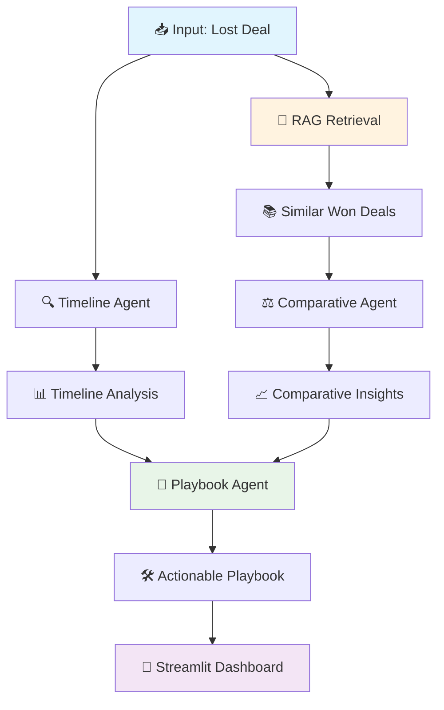

# Deal Forensics AI: Post-Mortem Sales Analysis Agent

## 🚀 Overview
**Deal Forensics AI** is an intelligent multi-agent system that performs forensic analysis on lost sales deals. Using RAG and Agentic AI, it identifies why deals were lost, pinpoints exact failure moments, and generates actionable playbooks to prevent future losses.

> **Intelligent Sales Intelligence Platform** - Built with Multi-Agent AI Architecture

---

## 🏗️ System Architecture

```
Deal Forensics AI Pipeline:
    
    📁 Data Layer
        │
        ├── sample_deals.json (Deal timelines & outcomes)
        └── crm_data.json (Sales intelligence context)
        │
    🔍 RAG System (ChromaDB)
        │
    🤖 AI Agent Orchestration
        │
        ├── Timeline Agent (Forensic Analysis)
        ├── Comparative Agent (RAG-Powered Insights) 
        └── Playbook Agent (Action Generation)
        │
    📊 Visualization & Output
        │
        ├── Interactive Timelines
        ├── Comparative Analytics
        └── Actionable Playbooks
```

## 🔄 Workflow Diagram



---

## 📁 Project Structure

```
deal_forensics/
├── 🐍 main.py                          # Streamlit application entry point
├── 📁 agents/                          # AI Agent System
│   ├── __init__.py
│   ├── 🕰️ timeline_agent.py           # Forensic timeline analysis
│   ├── ⚖️ comparative_agent.py        # RAG-powered deal comparison  
│   └── 🎯 playbook_agent.py           # Actionable playbook generation
├── 📁 rag/                             # Retrieval-Augmented Generation
│   ├── __init__.py
│   └── 🔍 vector_store.py             # ChromaDB vector database operations
├── 📁 data/                            # Data Layer
│   ├── 💼 sample_deals.json           # Deal timelines & outcomes
│   └── 👥 crm_data.json               # Sales intelligence context
├── 📁 utils/                           # Utilities & Visualization
│   ├── __init__.py
│   ├── 📊 visualizer.py               # Plotly charts & timelines
│   └── 🛠️ helpers.py                  # Utility functions
├── 📁 config/                          # Configuration
│   ├── __init__.py
│   ├── ⚙️ settings.py                 # Environment & API configuration
│   └── 💬 prompts.yaml                # AI prompt templates
└── 📄 requirements.txt                 # Python dependencies
```

---

## 🔍 Detailed File Descriptions

### **Core Application**
- **`main.py`** - Streamlit web application with interactive dashboard
  - Deal selection interface
  - Multi-agent orchestration
  - Real-time analysis visualization
  - Results presentation layer


```markdown
## 🎯 Prompt Engineering Architecture

This project implements **Structured JSON Prompting** with **Role-Based Context** across a multi-agent system.

### **Agent-Specific Prompt Design**

#### **Timeline Agent** - Analytical Prompting
```python
# Forensic analysis with structured output
- Critical moment identification
- Warning signal detection
- Failure point analysis
- Response time evaluation
- Timeline scoring (1-10)
```

#### **Comparative Agent** - RAG-Augmented Prompting
```python
# Comparative analysis with retrieved context
- Strategy comparison (won vs lost)
- Response time benchmarking
- Competitive positioning analysis
- Success factor identification
```

#### **Playbook Agent** - Action-Oriented Prompting
```python
# Actionable output generation
- Immediate action steps
- Trigger-based responses
- Escalation protocols
- Success metrics definition
```

### **Key Prompt Engineering Features**

| Feature | Implementation | Benefit |
|---------|---------------|---------|
| **Structured Output** | Enforced JSON schema | Programmatic processing |
| **Role-Based Context** | Specialized agent personas | Domain-specific reasoning |
| **Constrained Generation** | Defined value ranges | Quality control |
| **RAG Integration** | Context-augmented prompts | Historical pattern matching |

### **Prompt Quality Highlights**
✅ Consistent structure across all agents  
✅ Sales domain-specific terminology  
✅ Action-oriented, measurable outputs  
✅ Production-ready JSON responses  
✅ Multi-step reasoning capability


### **🤖 AI Agents System**

#### **1. Timeline Agent** (`agents/timeline_agent.py`)
- **Purpose**: Forensic analysis of deal timeline
- **Key Features**:
  - Identifies critical failure moments
  - Analyzes response time patterns
  - Detects warning signals
  - Generates timeline scores (1-10)
- **Input**: Single deal timeline data
- **Output**: Structured analysis with failure points and recommendations

#### **2. Comparative Agent** (`agents/comparative_agent.py`) 
- **Purpose**: RAG-powered comparison with successful deals
- **Key Features**:
  - Leverages vector database retrieval
  - Identifies winning vs losing patterns
  - Provides quantitative benchmarks
  - Generates improvement opportunities
- **Input**: Lost deal + RAG-retrieved won deals
- **Output**: Comparative insights and strategy differences

#### **3. Playbook Agent** (`agents/playbook_agent.py`)
- **Purpose**: Generates actionable sales playbooks
- **Key Features**:
  - Creates trigger-based responses
  - Defines escalation protocols
  - Sets success metrics
  - Provides competitor strategies
- **Input**: Timeline analysis + Comparative analysis
- **Output**: Actionable playbook with specific steps

### **🔍 RAG System** (`rag/vector_store.py`)
- **Vector Database**: ChromaDB with sentence-transformers embeddings
- **Data Source**: `sample_deals.json` timeline data
- **Retrieval Method**: Semantic similarity search
- **Usage**: Finds similar won deals for comparative analysis
- **Key Operations**: Store deals, search similar deals, metadata filtering

### **📊 Visualization** (`utils/visualizer.py`)
- Interactive timeline charts with critical moments
- Comparative analysis bar charts
- Improvement opportunity prioritization
- Success metric gauges
- Color-coded event visualization

### **🛠️ Utilities** (`utils/helpers.py`)
- Environment setup and validation
- Data processing and formatting
- Analysis persistence
- Demo support functions

### **📁 Data Layer**
- **`sample_deals.json`**: 4 lost deals + 4 won deals with detailed timelines, industries, values, and competitor data
- **`crm_data.json`**: Sales team performance, competitor intelligence, performance benchmarks, playbook templates

### **⚙️ Configuration**
- **`config/settings.py`**: API keys and environment configuration
- **`config/prompts.yaml`**: AI prompt templates for consistent agent behavior

---

## 🧠 RAG + Agentic AI Implementation

### **RAG Architecture**
```python
# RAG Flow in Comparative Agent
1. Query: "TechCorp Inc" + deal context
2. Retrieval: ChromaDB finds similar won deals using semantic similarity
3. Augmentation: Retrieved deals fed to AI agent as context
4. Generation: Comparative insights with historical context and patterns
```

### **Agentic AI Workflow**
```
Timeline Agent (Single-deal analysis)
        ↓
Comparative Agent (Cross-deal patterns) ← RAG Retrieval
        ↓  
Playbook Agent (Synthesis & actions)
```

### **Multi-Agent Specialization**
- **Timeline Agent**: Deep analysis of individual deal progression
- **Comparative Agent**: Pattern recognition across multiple deals (RAG-powered)
- **Playbook Agent**: Action synthesis and recommendation generation

### **RAG Implementation Details**
- **Embeddings**: ChromaDB's default sentence-transformers (all-MiniLM-L6-v2)
- **Retrieval**: Semantic similarity search with metadata filtering
- **Context Usage**: Retrieved won deals provide benchmark patterns
- **Integration**: Seamlessly feeds into Comparative Agent for enhanced insights

---

## 🚀 Quick Start

### **1. Installation**
```bash
git clone <repository-url>
cd deal_forensics
pip install -r requirements.txt
```

### **2. Environment Setup**
```bash
export GEMINI_API_KEY="your-google-ai-api-key"
```

### **3. Run Application**
```bash
streamlit run main.py
```

### **4. Usage Flow**
1. **Select** a lost deal from sidebar
2. **Click** "Run Forensic Analysis" 
3. **View** timeline analysis with failure points
4. **Explore** comparative insights vs won deals
5. **Implement** generated playbook actions

---

## 💡 Key Features

### **🔍 Forensic Analysis**
- Pinpoints exact moment deals went wrong
- Identifies response time failures
- Detects early warning signals
- Scores timeline management (1-10)
- Visual timeline with critical events

### **📊 Comparative Intelligence** 
- RAG-powered pattern matching across deal history
- Benchmarking against successful deals
- Industry-specific insights and patterns
- Competitor strategy analysis
- Quantitative performance comparisons

### **🎯 Actionable Outputs**
- Immediate priority actions with owners and timelines
- Trigger-based response protocols
- Success measurement metrics
- Escalation procedures
- Competitor-specific strategies

### **📈 Business Impact**
- **Data-driven sales coaching** and improvement
- **Continuous learning system** from every deal
- **Scalable across sales teams** and organizations
- **Proactive risk identification** in active deals

---

## 🛠️ Technical Stack

| Component | Technology | Purpose |
|-----------|------------|---------|
| **Frontend** | Streamlit | Interactive dashboard and UI |
| **AI/ML** | Google Gemini API | LLM for agent reasoning and analysis |
| **Vector DB** | ChromaDB | RAG implementation and semantic search |
| **Visualization** | Plotly | Interactive charts and timelines |
| **Data Processing** | Pandas | Data manipulation and analysis |
| **Configuration** | PyYAML | Prompt templates and settings |

---

## 🎯 Business Value Proposition

**Problem**: Sales teams lose 60-70% of deals without systematic learning
**Solution**: Automated forensic analysis with actionable, data-driven insights
**Impact**: Transform lost deals into learning opportunities for continuous improvement

### **Enterprise Ready Features**
- **Modular architecture** for easy extension and maintenance
- **API-ready design** for CRM integration (Salesforce, HubSpot, etc.)
- **Scalable infrastructure** across sales organizations
- **Configurable system** for different industries and sales processes

---

## 🔮 Future Enhancements

### **Short-term Roadmap**
- Custom sentence-transformers embeddings for domain specificity
- Hybrid search implementation (vector + keyword + semantic)
- RAG evaluation metrics and quality assessment
- A/B testing framework for retrieval strategies

### **Long-term Vision**
- CRM integrations (Salesforce, HubSpot APIs)
- Real-time deal monitoring and alerting
- Predictive win probability scoring
- Sales rep performance analytics and coaching
- Advanced pattern recognition with machine learning

