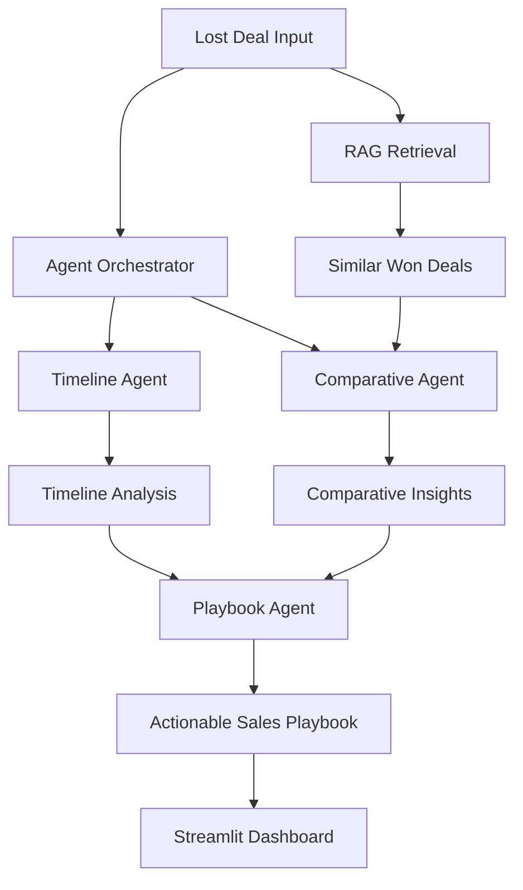

# Deal Forensics AI: Post-Mortem Sales Analysis System

## 🚀 Overview

**Deal Forensics AI** is an AI-powered system that performs forensic analysis on lost sales deals to identify why they failed and generate actionable strategies for improvement.

The platform combines **Retrieval-Augmented Generation (RAG)** with a **multi-stage LLM analysis pipeline** to evaluate deal timelines, compare them with historical successful deals, and produce structured playbooks for future sales engagements.

> **Goal:** Transform lost deals into structured learning insights for sales teams.

🎥 Demo: [https://youtu.be/FsLhDLGmB2M](https://youtu.be/FsLhDLGmB2M)

---

# 🏗️ System Architecture

The system processes sales deal data through a multi-stage analysis pipeline.

```
Deal Forensics AI Pipeline

Data Layer
 ├── sample_deals.json (deal timelines & outcomes)
 └── crm_data.json (sales intelligence context)

RAG Retrieval Layer
 └── ChromaDB vector database

LLM Orchestration Layer
 └── Agent Orchestrator (central controller)

Analysis Modules
 ├── Timeline Agent
 ├── Comparative Agent
 └── Playbook Agent

Visualization Layer
 └── Streamlit dashboard
```

---

# 🔄 Workflow


```mermaid
graph TD
    A[Lost Deal Input] --> B[Agent Orchestrator]

    B --> C[Timeline Agent]
    C --> D[Timeline Analysis]

    A --> E[RAG Retrieval]
    E --> F[Similar Won Deals]

    B --> G[Comparative Agent]
    F --> G
    G --> H[Comparative Insights]

    D --> I[Playbook Agent]
    H --> I
    I --> J[Actionable Sales Playbook]

    J --> K[Streamlit Dashboard]
```

---

# 🤖 Multi-Agent Analysis System

The system uses specialized LLM modules that perform different analytical tasks.

## 1️⃣ Timeline Agent

Performs forensic analysis on the progression of a single deal.

Responsibilities:

* Identify critical failure points
* Detect warning signals in deal progression
* Analyze response time delays
* Generate a timeline score (1–10)

Output:

* Structured analysis of deal breakdown.

---

## 2️⃣ Comparative Agent (RAG-Powered)

Compares the lost deal against historical successful deals.

Process:

1. Retrieve similar successful deals from the vector database.
2. Compare sales strategies and engagement patterns.
3. Identify differences between winning and losing approaches.

Output:

* Pattern-based insights and improvement opportunities.

---

## 3️⃣ Playbook Agent

Synthesizes insights from previous agents to generate actionable recommendations.

Responsibilities:

* Create recovery strategies
* Define escalation protocols
* Suggest competitor response strategies
* Generate measurable success metrics

Output:

* Actionable sales playbook.

---

# 🔍 Retrieval-Augmented Generation (RAG)

The system integrates semantic search to enhance analysis.

Workflow:

```
Deal Context
   ↓
Vector Search (ChromaDB)
   ↓
Retrieve Similar Won Deals
   ↓
Provide Context to Comparative Agent
   ↓
Generate Insightful Analysis
```

### Implementation

* Vector database: **ChromaDB**
* Embeddings: **sentence-transformers (all-MiniLM-L6-v2)**
* Retrieval: semantic similarity search with metadata filtering

---

# 📊 Visualization Dashboard

The system provides an interactive **Streamlit dashboard** that displays:

* Deal timeline analysis
* Comparative performance insights
* Improvement opportunity rankings
* AI-generated sales playbooks

Visualization tools:

* Plotly interactive charts
* Timeline event visualizations
* Comparative performance graphs

---

# 📁 Project Structure

```
deal_forensics/

main.py
    Streamlit application entry point

agents/
    orchestrator.py        LLM controller
    timeline_agent.py      Deal timeline analysis
    comparative_agent.py   RAG-based comparison
    playbook_agent.py      Actionable playbook generation

rag/
    vector_store.py        ChromaDB retrieval system

data/
    sample_deals.json      Deal timelines
    crm_data.json          Sales intelligence data

utils/
    visualizer.py          Plotly dashboards
    helpers.py             Utility functions

config/
    settings.py            Environment configuration
    prompts.yaml           Prompt templates

requirements.txt
```

---

# 🧠 Prompt Engineering Strategy

The system uses **structured prompting** and **role-based contexts** for each analysis module.

| Agent             | Purpose                                       |
| ----------------- | --------------------------------------------- |
| Timeline Agent    | Forensic timeline evaluation                  |
| Comparative Agent | Pattern analysis using retrieved deal history |
| Playbook Agent    | Generation of structured action plans         |

Key prompt design principles:

* Structured JSON outputs
* Domain-specific sales context
* Multi-step reasoning
* Controlled value ranges for scoring

---

# 🚀 Quick Start

## 1️⃣ Clone the Repository

```bash
git clone <repository-url>
cd deal_forensics
```

## 2️⃣ Install Dependencies

```bash
pip install -r requirements.txt
```

## 3️⃣ Configure Environment

Set your Gemini API key:

```bash
export GEMINI_API_KEY="your-api-key"
```

## 4️⃣ Run the Application

```bash
streamlit run main.py
```

## 5️⃣ Usage

1. Select a lost deal from the sidebar.
2. Run forensic analysis.
3. Explore timeline insights and comparative patterns.
4. Review the generated playbook.

---

# 🛠️ Technology Stack

| Component       | Technology            |
| --------------- | --------------------- |
| Frontend        | Streamlit             |
| LLM             | Google Gemini         |
| Vector Database | ChromaDB              |
| Embeddings      | Sentence Transformers |
| Visualization   | Plotly                |
| Data Processing | Pandas                |
| Configuration   | YAML                  |

---

# 📈 Business Impact

Sales teams often lose deals without understanding why.

Deal Forensics AI enables:

* Structured analysis of deal failures
* Data-driven sales coaching
* Identification of winning engagement patterns
* Continuous learning from historical deal data

---

# 🔮 Future Improvements

Planned enhancements include:

* Hybrid retrieval (vector + keyword)
* Domain-specific embedding models
* Evaluation metrics for RAG quality
* CRM integrations (Salesforce / HubSpot)
* Predictive win probability modeling

---

# 📜 License

MIT License
