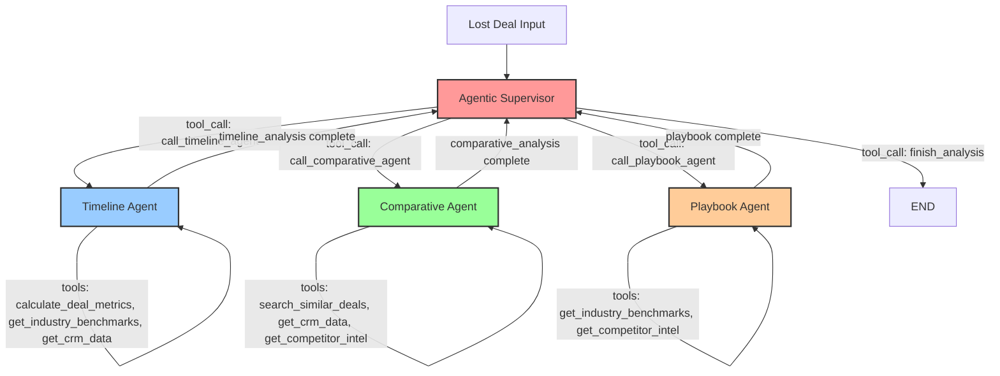

# Deal Forensics AI

AI-powered sales deal analysis system that examines lost deals and generates actionable playbooks using LangGraph multi-agent architecture.

## What it does

The system takes a lost sales deal as input and runs it through three specialized agents that:
1. Analyze the deal timeline to find failure points and warning signals
2. Compare it against similar won deals using hybrid RAG (BM25 + vector search)
3. Generate a structured sales playbook with actionable recommendations

**Business value:** Helps sales teams understand why deals were lost, identify winning patterns from historical data, and get data-driven recovery strategies.

## Dashboard Pages

### 1_Dashboard — Main Analysis
- Select a lost deal from the sidebar (or upload custom JSON)
- Runs the full LangGraph workflow: Timeline Agent → Comparative Agent → Playbook Agent
- Displays timeline analysis with failure points, warning signals, and response time metrics
- Shows comparative analysis against similar won deals with strategy differences
- Generates a playbook with immediate actions, trigger responses, and competitor counter-strategies
- Win probability gauge (pre and post-analysis)
- Agent trace visualization showing ReAct reasoning steps
- PDF export of the generated playbook

### 2_Batch Analysis
- Runs forensic analysis across multiple lost deals simultaneously
- Displays a summary table with timeline scores, confidence levels, and win probabilities
- Progress tracking for each deal being analyzed
- Downloads batch results as JSON

### 3_Win Probability
- Standalone win probability calculator (no agent workflow needed)
- Three input modes: Form Builder, JSON Upload, or Paste JSON
- Calculates win probability score (0-100%) with risk levels: Low, Medium, High, Critical
- Factor breakdown chart showing positive/negative impacts
- Top recommendations to improve deal odds
- Benchmark section showing how to reach 70%+ probability

### 4_RAG Evaluation
- Measures retrieval quality using Hit Rate @ k and MRR (Mean Reciprocal Rank)
- Live query tester to search the hybrid RAG system
- Adjustable BM25/vector weights and top-k results
- Per-query results showing retrieved deals vs. expected outcomes
- Weight tuning guidance for better retrieval

## Tech Stack

| Component | Technology |
|-----------|------------|
| UI Framework | Streamlit |
| LLM Orchestration | LangGraph (StateGraph) |
| LLM Provider | Groq (llama-3.3-70b-versatile) |
| Vector Database | ChromaDB |
| Embeddings | sentence-transformers (all-MiniLM-L6-v2) |
| Keyword Search | BM25 (langchain_community) |
| Ensemble Retrieval | LangChain EnsembleRetriever (Reciprocal Rank Fusion) |
| Visualization | Plotly |
| Data Processing | Pandas |
| Configuration | YAML (prompts), python-dotenv |

## Agentic Architecture

The system uses a **supervisor pattern** with three specialized agents, orchestrated by LangGraph:

```
supervisor → timeline_agent → supervisor
          → comparative_agent → supervisor
          → playbook_agent → supervisor → END
```

### Agent State (shared across all agents)
- `messages`: Conversation + tool call history (LangChain messages)
- `deal_id`: Current deal being analyzed
- `lost_deal`: Full deal data dict
- `timeline_analysis`: Output from Timeline Agent
- `comparative_analysis`: Output from Comparative Agent
- `playbook`: Output from Playbook Agent
- `agent_trace`: ReAct reasoning steps for UI display
- `similar_won_deals`: Retrieved documents from RAG
- `errors`: Error messages during execution
- `next`: Routing target set by supervisor

### Agents and Tool Calls

#### Timeline Agent (`agents/timeline_agent.py`)
Analyzes deal progression and identifies failure points.

**Tools:**
- `calculate_deal_metrics` — Computes timeline duration, response gaps, critical events
- `get_industry_benchmarks` — Retrieves industry average response times
- `get_crm_data` — Fetches sales rep stats and org metrics

**Output:** JSON with timeline_score (1-10), failure_point, warning_signals, recommendations

#### Comparative Agent (`agents/comparative_agent.py`)
Compares lost deal against similar won deals using RAG.

**Tools:**
- `search_similar_deals` — Hybrid BM25 + vector search for similar won deals
- `get_crm_data` — Enriches context with CRM intelligence
- `get_competitor_intel` — Retrieves competitor playbook templates

**Output:** JSON with response_time_comparison, strategy_differences, improvement_opportunities, confidence_score

#### Playbook Agent (`agents/playbook_agent.py`)
Synthesizes insights into actionable recommendations.

**Tools:**
- `search_similar_deals` — Retrieves context for strategy generation
- `get_crm_data` — Gets sales team performance data

**Output:** JSON with immediate_actions, trigger_responses, competitor_strategies, success_metrics, expected_impact

## RAG Implementation

Hybrid retrieval combining two methods via `EnsembleRetriever` with Reciprocal Rank Fusion:

1. **BM25 Keyword Search** — In-memory index over all deal documents
2. **Vector Search (ChromaDB)** — Semantic search using `all-MiniLM-L6-v2` embeddings

**Query enhancements:**
- Automatic synonym expansion (e.g., "pricing" expands to "pricing cost budget price")
- Metadata hints added to queries (industry, deal type)
- Optional CrossEncoder reranking (set `USE_RERANKER=true` in .env)

**Document structure:**
```
{type} Deal | Company: X | Industry: Y | Value: $Z (tier) |
Reason: R | Competitors: A, B | Region: R | Sales Rep: S |
Key Phrases: ... | Timeline: Day 0: event — details | ...
```

## Project Structure

```
Deal-forensics/
├── main.py                    # Streamlit entry point
├── config/
│   ├── settings.py           # Environment config, model settings
│   ├── llm_helper.py        # LLM factory (Groq/Ollama)
│   └── prompts.yaml         # YAML prompt templates
├── graph/
│   ├── state.py             # AgentState TypedDict definition
│   └── workflow.py         # LangGraph StateGraph builder
├── agents/
│   ├── timeline_agent.py     # ReAct agent with 3 tools
│   ├── comparative_agent.py  # ReAct agent with RAG + 2 tools
│   └── playbook_agent.py   # ReAct agent with 2 tools
├── tools/
│   ├── analytics_tools.py   # calculate_deal_metrics, get_industry_benchmarks
│   ├── crm_tools.py        # get_crm_data, get_competitor_intel
│   └── rag_tools.py        # search_similar_deals (hybrid RAG)
├── rag/
│   ├── vector_store.py      # HybridDealRetriever (BM25 + ChromaDB)
│   ├── data_processor.py    # Loads JSON, computes metrics, CRM enrichment
│   └── evaluator.py        # Hit Rate, MRR evaluation
├── utils/
│   ├── visualizer.py       # Plotly charts (gauge, timeline, factors)
│   ├── win_probability.py  # Win probability calculator
│   ├── helpers.py          # Environment checks, formatting, validation
│   └── pdf_exporter.py    # Generates playbook PDF
├── pages/
│   ├── 1_Dashboard.py     # Main analysis page
│   ├── 2_Batch_Analysis.py
│   ├── 3_Win_Probability.py
│   └── 4_RAG_Evaluation.py
├── data/
│   ├── sample_deals.json   # 100+ won/lost deals
│   ├── crm_data.json       # Sales team, performance metrics
│   └── benchmarks.json    # Industry benchmarks
├── chroma_db/             # ChromaDB persistent storage
└── requirements.txt
```

## Quick Start

### 1. Install dependencies
```bash
pip install -r requirements.txt
```

### 2. Configure environment
Create `.env` file:
```
LLM_PROVIDER=groq
GROQ_API_KEY=gsk_your_key_here
```

Get a free Groq API key at https://console.groq.com

### 3. Run the application
```bash
streamlit run main.py
```

### 4. Usage
1. Select a lost deal from the sidebar
2. Click "Run Forensic Analysis"
3. Explore timeline insights, comparative patterns, and generated playbook
4. Try other pages for batch analysis, win probability, or RAG evaluation

## Proven Results

Based on actual system runs with sample deal "Genco Pura Olive Oil Company (LD-0012)":

### RAG Evaluation (4_RAG_Evaluation page)
- **MRR: 0.875** — Most retrieved deals ranked at position 1-2
- Hybrid BM25 + vector search with query expansion working as designed

### Agentic Analysis (1_Dashboard page)
- **12 tool calls** across 3 agents (Timeline: 3, Comparative: 4, Playbook: 4)
- **Timeline Score: 4/10** — Accurately identified 86-day deal with 66-day max gap
- **Win Probability: 20% (Critical Risk)** — Matched poor timeline metrics
- **Competitor Analysis:** Retrieved intel on 3 competitors (D, E, C) with strengths/weaknesses
- **Playbook Generated:** 3 immediate actions, 3 trigger responses, 3 competitor counter-strategies

### What the System Detected
- Failure point: Day 86 — "Lost to competitor — better pricing"
- Response time gap: 21.5d vs industry avg 1.5d
- 3 long gaps (>3 days) detected
- 3 competitors identified with counter-strategies

## LangGraph Workflow


```mermaid
graph TD
    A[Lost Deal Input] --> B[Agentic Supervisor]
    
    B -->|"tool_call: call_timeline_agent"| C[Timeline Agent]
    B -->|"tool_call: call_comparative_agent"| D[Comparative Agent]
    B -->|"tool_call: call_playbook_agent"| E[Playbook Agent]
    B -->|"tool_call: finish_analysis"| F[END]
    
    C -->|"timeline_analysis complete"| B
    D -->|"comparative_analysis complete"| B
    E -->|"playbook complete"| B
    
    C -->|"tools: calculate_deal_metrics, get_industry_benchmarks, get_crm_data"| C
    D -->|"tools: search_similar_deals, get_crm_data, get_competitor_intel"| D
    E -->|"tools: get_industry_benchmarks, get_competitor_intel"| E
    
    style B fill:#ff9999,stroke:#333,stroke-width:2px
    style C fill:#99ccff,stroke:#333,stroke-width:2px
    style D fill:#99ff99,stroke:#333,stroke-width:2px
    style E fill:#ffcc99,stroke:#333,stroke-width:2px
```

**Supervisor Decision Logic:**
The supervisor uses LLM with `bind_tools()` to dynamically decide which agent to run next, based on current state completeness (timeline → comparative → playbook → finish).

## License

MIT License
